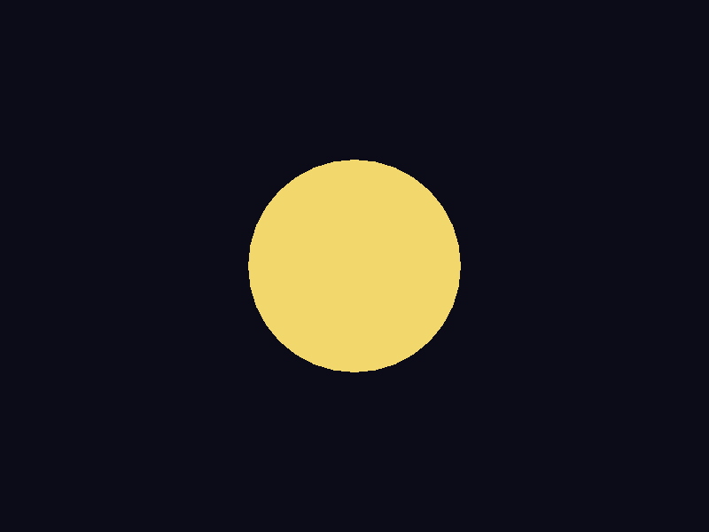
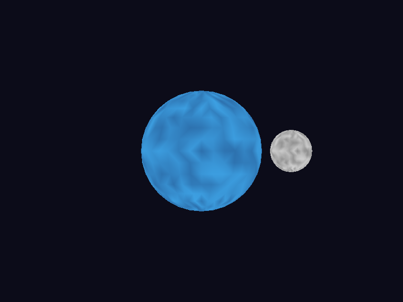
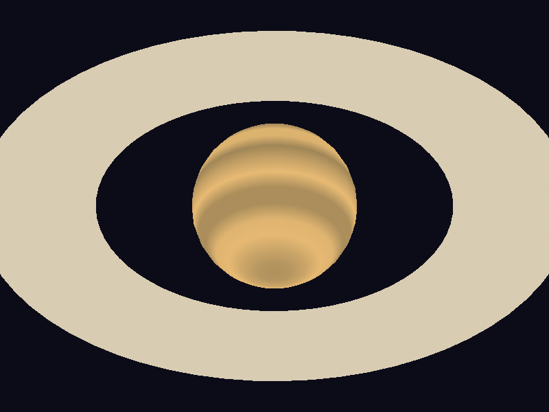
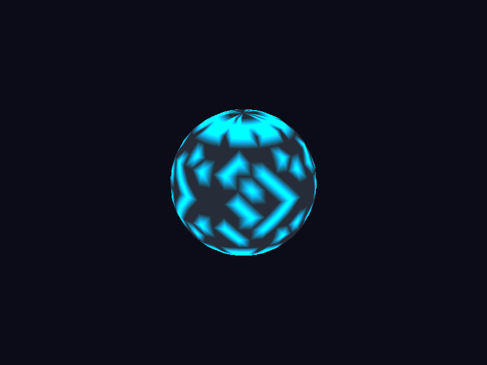
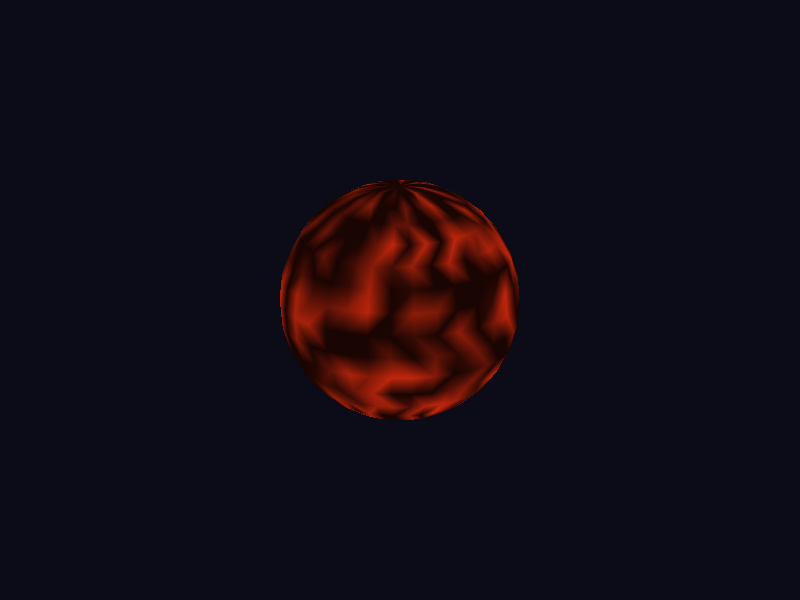
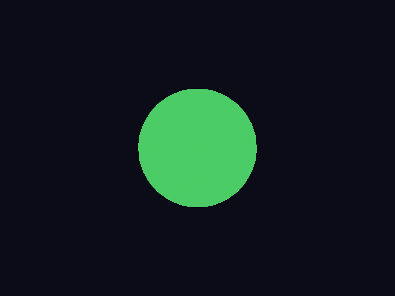

# Lab 5: Shaders


## Planetas

  ⭐ Estrella

  🌎 Planeta Rocoso

  🪐 Planeta Gaseoso

  🤖 Planeta Cibernético

  🌋 Planeta de Magma 

  🟩 Planeta Plano

  🌙 Luna 
  🪐 Sistema de Anillos  

## 🎮 Controles

  `1`               Estrella
  `2`               Planeta Rocoso
  `3`               Gigante Gaseoso
  `4`               Planeta Cibernético
  `5`               Planeta de Magma
  `6`               Planeta Plano

  `←/→/↑/↓`         Mover objeto

  `Q / W / E / R`   Rotar

  `A / S`           Escalar

  `P`               Guardar captura


## 📂 Archivos principales

```
src/
 ├── main.rs          # Lógica principal, render loop
 ├── framebuffer.rs   # Framebuffer + funciones de dibujo y guardado
 ├── triangle.rs      # Rasterizador de triángulos
 ├── vertex.rs        # Estructura de vértices
 ├── fragment.rs      # Representa un fragmento (píxel)
 ├── shaders.rs       # Vertex shader básico
 ├── obj.rs           # Carga de modelos .obj
 ├── ring.obj`        # Modelo de anillo plano para planeta gaseoso
 └── matrix.rs        # Utilidades de matrices 4x4
```


## ⚙️ Requisitos

- **Rust** (>= 1.70)
- **Raylib** (instalada en el sistema)
- Dependencias en `Cargo.toml`:
  ```toml
  [dependencies]
  raylib = "3.7"
  tobj = "3.0"


## 📌 Ejecución

``` bash
cargo run
```

Capturar imagen con `P`.


------------------------------------------------------------------------

## 🎥 Video de Funcionamiento


https://youtu.be/kO8CZettksI

------------------------------------------------------------------------

## 🖼 Capturas de los Planetas


### ☀️ Estrella



### 🌎 Planeta Rocoso + Luna



### 🪐 Gigante Gaseoso + Anillos



### 🤖 Planeta Cibernético



### 🌋 Planeta de Magma



### 🟩 Planeta Plano



------------------------------------------------------------------------
